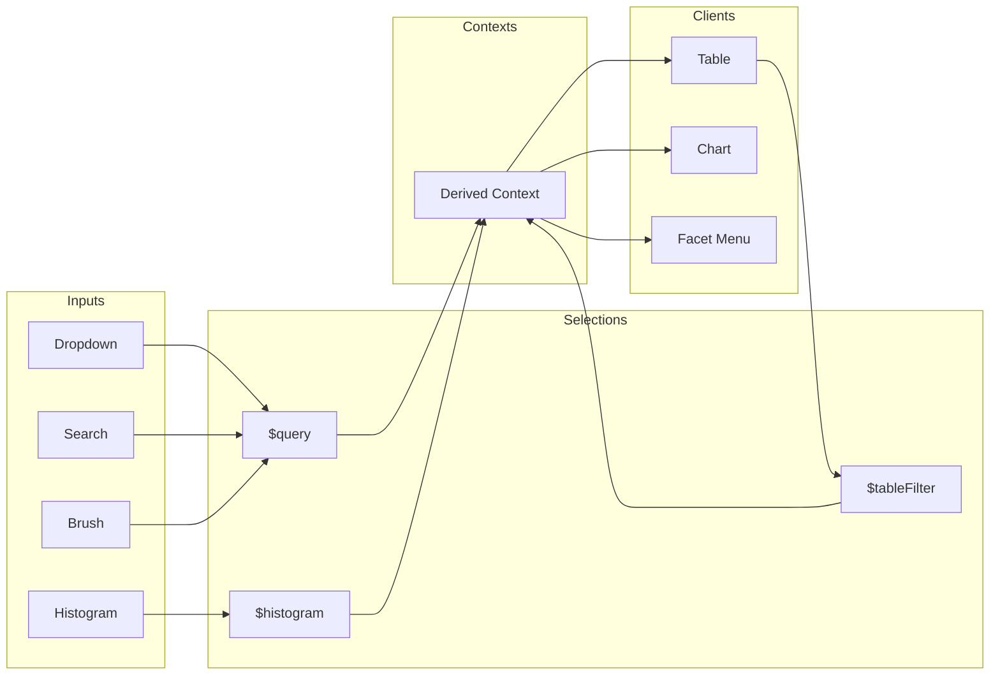
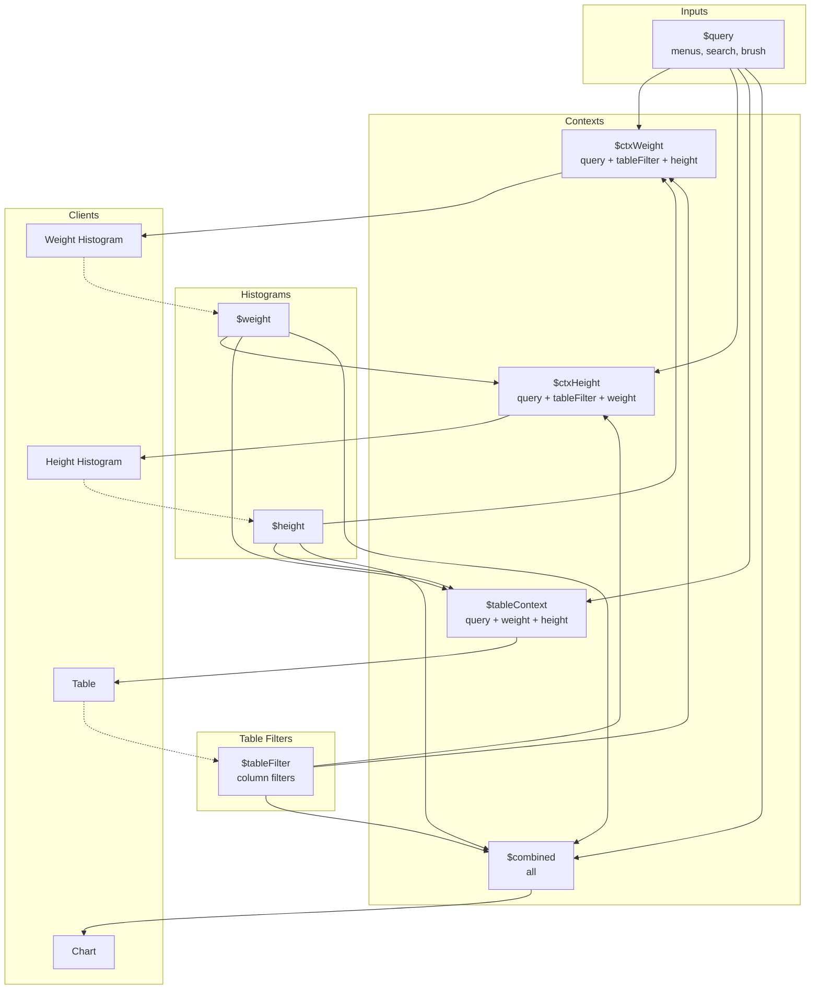
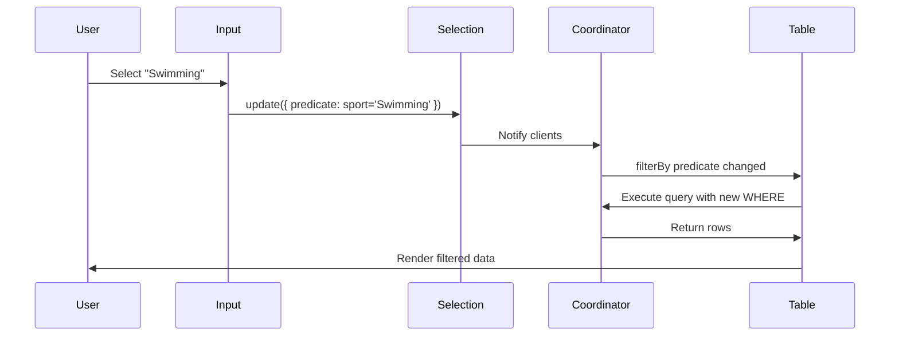

# Data Flow

This guide explains how data and filter state flow through a Mosaic-powered dashboard. Understanding this flow is key to building responsive, cross-filtered interfaces.

For package roles and where concepts live, see [Package Map](./package-map.md).

## The Big Picture



**Flow summary:**

1. **Inputs** (dropdowns, search, brushes) update **Selections**
2. **Selections** are composed into **Contexts** via `Selection.intersect({ include: [...] })`
3. **Clients** (tables, charts) subscribe to contexts via `filterBy`
4. When a selection changes, all downstream clients re-query automatically

## Selection Updates

When a user interacts with an input, it calls `selection.update()`:

```ts
$query.update({
  source: myInputId, // Unique identifier for this input
  value: 'Swimming', // The raw value (for bookkeeping)
  predicate: sql`sport = 'Swimming'`, // SQL WHERE fragment
});
```

The coordinator:

1. Stores the clause keyed by `source`
2. Notifies all clients filtering by this selection
3. Clients re-query with the new predicate

### Clearing a Selection

To clear a specific input's contribution:

```ts
$query.update({
  source: myInputId,
  value: null,
  predicate: null,
});
```

To reset the entire selection (all sources):

```ts
$query.reset();
```

## Contexts and Topology

A **context** is a derived selection that composes multiple upstream selections. This is how you control what each client "sees."

### Example: Athletes Dashboard

```ts
// Inputs: menus, search, chart brush
const $query = vg.Selection.intersect();

// Table column filters
const $tableFilter = vg.Selection.intersect();

// Histogram brushes (separate to enable cross-filter exclusion)
const $weight = vg.Selection.intersect();
const $height = vg.Selection.intersect();

// Table context: inputs + histograms (NOT its own column filters)
const $tableContext = vg.Selection.intersect({
  include: [$query, $weight, $height],
});

// Weight histogram context: everything EXCEPT weight
const $ctxWeight = vg.Selection.intersect({
  include: [$query, $tableFilter, $height],
});

// Global combined: everything (for main chart)
const $combined = vg.Selection.intersect({
  include: [$query, $tableFilter, $weight, $height],
});
```

This topology enables:

- **Cross-filtering**: Histogram brushes filter the table, but each histogram excludes itself
- **Separation of concerns**: Table column filters don't affect histograms
- **Composability**: New inputs just need to be added to the right `include` arrays



## Peer Cascading

A common pattern for filter dropdowns: each dropdown should be filtered by **all other inputs** but not by itself. This prevents the "ghost option" problem where selecting a value makes it disappear from the dropdown.

The `useCascadingContexts` hook automates this:

```ts
import {
  useMosaicSelections,
  useCascadingContexts,
} from '@nozzleio/react-mosaic';

const inputs = useMosaicSelections(['domain', 'device', 'date']);

// Each context includes all OTHER inputs + external filters
const inputContexts = useCascadingContexts(inputs, [externalContext]);

// Use:
// inputContexts.domain includes device + date + external
// inputContexts.device includes domain + date + external
// inputContexts.date includes domain + device + external
```

## Table Integration

The `useMosaicReactTable` hook wires everything together:

```ts
const { tableOptions } = useMosaicReactTable({
  table: 'athletes',
  filterBy: $tableContext, // External filters (inputs, histograms)
  tableFilterSelection: $tableFilter, // Where table column filters write
  columns,
  mapping: AthleteMapping,
});
```

**Data flow for the table:**

1. `filterBy` provides the external predicate (from inputs, histograms)
2. When column filters change, they update `tableFilterSelection`
3. The table re-queries with combined predicates
4. Results flow back to TanStack Table's `data` prop

## Query Lifecycle



## Transient Selections (Hover)

For high-frequency interactions like hover, use `Selection.single()` with a "no selection" default:

```ts
const NO_SELECTION = sql`1 = 0`; // Always false = no rows

const $hover = vg.Selection.single();
$hover.update({
  source: { id: 'hover' },
  value: null,
  predicate: NO_SELECTION,
});

// On row hover
function handleRowHover(row) {
  if (row) {
    $hover.update({
      source: { id: 'hover' },
      value: row.id,
      predicate: sql`id = ${row.id}`,
    });
  } else {
    $hover.update({
      source: { id: 'hover' },
      value: null,
      predicate: NO_SELECTION,
    });
  }
}
```

**Why `1 = 0`?** Unlike resetting, this keeps the selection "active" but matching zero rows. Overlay charts filter by `$hover` and show nothing when no row is hovered.

## Debugging Tips

1. **Enable logging**: The adapter has a built-in logger

   ```ts
   import { logger } from '@nozzleio/mosaic-tanstack-react-table';
   // Logger output appears in browser console
   ```

2. **Check predicates**: Log `selection.predicate(null)` to see the current WHERE clause

3. **Trace updates**: Add `__debugName` to hooks for labeled console output
   ```ts
   useMosaicReactTable({
     // ...
     __debugName: 'AthletesTable',
   });
   ```

## Next Steps

- [Simple Usage](../react/simple-usage.md) – Put these concepts into practice
- [Complex Setup](../react/complex-setup.md) – Multi-table dashboard patterns
- [Inputs](../react/inputs.md) – Building filter inputs and facet menus
- [Package Map](./package-map.md) – Which package to use and why
