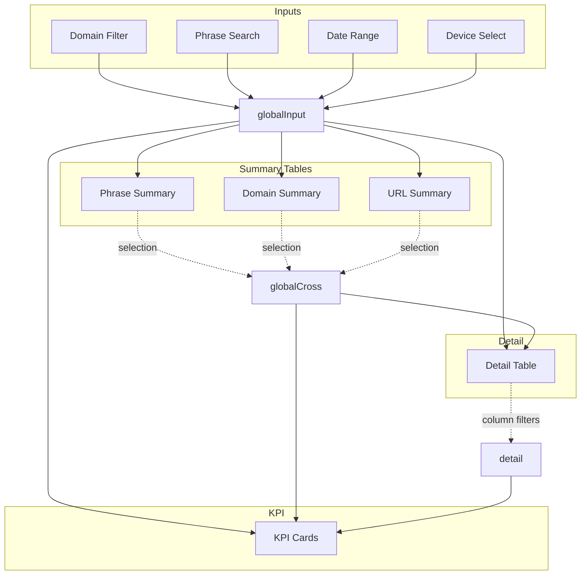

# Complex Setup

This guide covers advanced patterns for multi-table dashboards with cross-filtering, aggregation bridges, and coordinated inputs. It mirrors the patterns used in the PAA dashboard example.

## When You Need This

Use these patterns when your dashboard has:

- Multiple tables filtering each other (summary → detail)
- Aggregated views alongside raw data
- Many input controls that need peer-cascading
- Global reset functionality
- Active filter bar showing current selections

## The Topology Hook Pattern

For complex dashboards, encapsulate all selection wiring in a custom hook. This keeps view components clean and makes the topology testable.

```ts
// hooks/useDashboardTopology.ts
import { useMemo } from 'react';
import { Selection } from '@uwdata/mosaic-core';
import {
  useMosaicSelections,
  useCascadingContexts,
  useMosaicSelection,
  useRegisterSelections,
} from '@nozzleio/react-mosaic';

const INPUT_KEYS = ['domain', 'phrase', 'date', 'device'] as const;

export function useDashboardTopology() {
  // 1. Batch instantiate input selections
  const inputs = useMosaicSelections(INPUT_KEYS);

  // 2. Detail table filter
  const detail = useMosaicSelection('intersect');

  // 3. Summary table output selections
  const summaries = useMosaicSelections(['domain', 'phrase', 'url']);

  // 4. Register all for global reset
  const allSelections = useMemo(
    () => [...Object.values(inputs), detail, ...Object.values(summaries)],
    [inputs, detail, summaries],
  );
  useRegisterSelections(allSelections);

  // 5. Compute derived contexts
  const topology = useMemo(() => {
    const allInputs = Object.values(inputs);

    // Global input: all top-bar filters combined
    const globalInput = Selection.intersect({ include: allInputs });

    // Global cross: all summary table selections
    const globalCross = Selection.intersect({
      include: Object.values(summaries),
    });

    // What dropdowns see from "outside" (detail + summary tables)
    const externalContext = Selection.intersect({
      include: [detail, globalCross],
    });

    // Global context for KPIs (everything)
    const globalContext = Selection.intersect({
      include: [globalInput, detail, globalCross],
    });

    return { globalInput, globalCross, externalContext, globalContext };
  }, [inputs, summaries, detail]);

  // 6. Peer-cascading for inputs
  const inputContexts = useCascadingContexts(inputs, [
    topology.externalContext,
  ]);

  // 7. Summary contexts (each sees all others + inputs + detail)
  const summaryContexts = useCascadingContexts(summaries, [
    topology.globalInput,
    detail,
  ]);

  return {
    inputs,
    inputContexts,
    detail,
    detailContext: useMemo(
      () =>
        Selection.intersect({
          include: [topology.globalInput, topology.globalCross],
        }),
      [topology.globalInput, topology.globalCross],
    ),
    selections: summaries,
    summaryContexts,
    globalContext: topology.globalContext,
    externalContext: topology.externalContext,
  };
}
```

## Multi-Table Dashboard



### Using the Topology

```tsx
function DashboardView() {
  const topology = useDashboardTopology();

  return (
    <>
      {/* Input bar: each dropdown uses its cascading context */}
      <FilterBar>
        <DomainSelect
          selection={topology.inputs.domain}
          filterBy={topology.inputContexts.domain}
        />
        <PhraseSearch selection={topology.inputs.phrase} />
        <DateRange selection={topology.inputs.date} />
        <DeviceSelect
          selection={topology.inputs.device}
          filterBy={topology.inputContexts.device}
        />
      </FilterBar>

      {/* Summary tables: each writes to its selection, reads from its context */}
      <SummaryTable
        title="Phrases"
        filterBy={topology.summaryContexts.phrase}
        selection={topology.selections.phrase}
      />
      <SummaryTable
        title="Domains"
        filterBy={topology.summaryContexts.domain}
        selection={topology.selections.domain}
      />

      {/* Detail table: reads combined context */}
      <DetailTable
        filterBy={topology.detailContext}
        tableFilterSelection={topology.detail}
      />

      {/* KPIs: read global context (everything) */}
      <KpiCards filterBy={topology.globalContext} />
    </>
  );
}
```

## Aggregation Bridge

When you need both raw and aggregated views of the same data, use a **query factory** instead of a table name:

```ts
import * as mSql from '@uwdata/mosaic-sql';

const summaryQueryFactory = (filter) => {
  return mSql.Query.from('trips')
    .select({
      zone_x: mSql.sql`round(dx / 1000)`,
      zone_y: mSql.sql`round(dy / 1000)`,
      trip_count: mSql.count(),
      avg_fare: mSql.avg('fare_amount'),
    })
    .where(filter)
    .groupby('zone_x', 'zone_y');
};

// Use in the hook
const { tableOptions } = useMosaicReactTable<SummaryRowData>({
  table: summaryQueryFactory, // <-- Query factory, not string
  filterBy: $summaryContext,
  columns: summaryColumns,
  mapping: SummaryMapping,
});
```

The adapter calls your factory with the current filter predicate, enabling dynamic aggregation queries.

## Row Selection → Filter

Summary tables often act as filters: clicking a row filters the detail table. Use the `rowSelection` option:

```ts
const { tableOptions } = useMosaicReactTable<GroupByRow>({
  table: summaryQueryFactory,
  filterBy: phraseContext,
  rowSelection: {
    selection: $phraseSelection, // Updates this selection on row select
    column: 'phrase', // The column to use as filter value
    columnType: 'scalar', // 'scalar' or 'array'
  },
  tableOptions: {
    enableRowSelection: true,
    enableMultiRowSelection: true,
    getRowId: (row) => String(row.key),
  },
});
```

When users select rows, the adapter updates `$phraseSelection` with predicates like `phrase IN ('value1', 'value2')`.

## Total Rows Modes

Large tables often need a reliable total row count. The adapter supports two strategies:

- `totalRowsMode: 'window'` uses a window function to attach the total to each row
- `totalRowsMode: 'split'` runs a separate total query (often faster for complex group-bys)

Example (detail table in PAA):

```ts
const { tableOptions } = useMosaicReactTable<PaaRowData>({
  table: 'nozzle_paa',
  filterBy: topology.detailContext,
  tableFilterSelection: topology.detail,
  columns,
  mapping: PaaMapping,
  totalRowsColumnName: '__total_rows',
  totalRowsMode: 'split',
});
```

Example (simple tables):

```ts
const { tableOptions } = useMosaicReactTable<AthleteRowData>({
  table: 'athletes',
  filterBy: $tableContext,
  columns,
  mapping: AthleteMapping,
  totalRowsMode: 'window',
});
```

## Highlight vs Filter

Sometimes you want to highlight matching rows without filtering them out. Use `manualHighlight`:

```ts
const queryFactory = (filter) => {
  // Add a computed column for highlighting
  const highlightPred = $mySelection.predicate(null);
  const highlightCol = highlightPred
    ? mSql.max(mSql.sql`CASE WHEN ${highlightPred} THEN 1 ELSE 0 END`)
    : mSql.literal(1);

  return mSql.Query.from('data')
    .select({
      key: 'category',
      metric: mSql.count(),
      __is_highlighted: highlightCol,
    })
    .where(filter)
    .groupby('category');
};

const { tableOptions } = useMosaicReactTable({
  table: queryFactory,
  manualHighlight: true, // Don't auto-filter by $mySelection
  columns: [
    // ... visible columns
    {
      accessorKey: '__is_highlighted',
      meta: { mosaicDataTable: { sqlColumn: '__is_highlighted' } },
    },
  ],
  tableOptions: {
    initialState: {
      columnVisibility: { __is_highlighted: false },
    },
  },
});
```

Then style rows based on the hidden `__is_highlighted` column.

This pattern is used in `examples/react/trimmed/src/components/views/nozzle-paa.tsx` to keep summary tables highlighted without filtering out rows.

## Global Reset

Wrap your app with `SelectionRegistryProvider` and register selections:

```tsx
import {
  SelectionRegistryProvider,
  useRegisterSelections,
  useSelectionRegistry,
} from '@nozzleio/react-mosaic';

// App wrapper
<SelectionRegistryProvider>
  <App />
</SelectionRegistryProvider>;

// In your view
useRegisterSelections([...allSelections]);

// Reset button
function ResetButton() {
  const { resetAll } = useSelectionRegistry();
  return <button onClick={resetAll}>Reset All Filters</button>;
}
```

## Active Filter Bar

Show users what filters are active with the filter registry:

```tsx
import {
  MosaicFilterProvider,
  useActiveFilters,
  useRegisterFilterSource,
  useFilterRegistry,
} from '@nozzleio/react-mosaic';

// Wrap app
<MosaicFilterProvider>
  <App />
</MosaicFilterProvider>;

// Register selections with labels
useRegisterFilterSource(topology.inputs.domain, 'global', {
  labelMap: { domain: 'Domain' },
});

// Display active filters
function ActiveFilterBar() {
  const filters = useActiveFilters();
  const registry = useFilterRegistry();

  if (filters.length === 0) return null;

  return (
    <div className="flex gap-2">
      {filters.map((filter) => (
        <span key={filter.id} className="badge">
          {filter.label}: {filter.displayValue}
          <button onClick={() => registry.clearFilter(filter.id)}>×</button>
        </span>
      ))}
    </div>
  );
}

For a full version (group registration, labels, and UI), see `examples/react/trimmed/src/components/views/nozzle-paa.tsx` and `examples/react/trimmed/src/components/active-filter-bar.tsx`.
```

## KPI Queries (Value Helpers)

For KPIs, use a query factory + `useMosaicValue` to return a single value that respects a filter context:

```ts
const qPhrases = (filter) =>
  mSql.Query.from('nozzle_paa')
    .select({ value: mSql.count('phrase').distinct() })
    .where(filter);

const valPhrases = useMosaicValue(qPhrases, topology.globalContext);
```

See `examples/react/trimmed/src/components/views/nozzle-paa.tsx` for the full KPI section.

## Hover Interactions

For chart ↔ table hover synchronization:

```ts
import * as mSql from '@uwdata/mosaic-sql';

const HOVER_SOURCE = { id: 'hover' };
const NO_SELECTION = mSql.sql`1 = 0`;

const $hover = vg.Selection.single();

// Initialize to "no selection"
$hover.update({
  source: HOVER_SOURCE,
  value: null,
  predicate: NO_SELECTION,
});

// On table row hover
function handleRowHover(row: Row | null) {
  if (row) {
    $hover.update({
      source: HOVER_SOURCE,
      value: row.original.id,
      predicate: mSql.eq(mSql.column('id'), mSql.literal(row.original.id)),
    });
  } else {
    $hover.update({
      source: HOVER_SOURCE,
      value: null,
      predicate: NO_SELECTION,
    });
  }
}

// Chart overlay filters by $hover
vg.dot(vg.from('data', { filterBy: $hover }), {
  x: 'x',
  y: 'y',
  stroke: 'red',
  r: 8,
});
```

**Important:** Don't register hover selections with `useRegisterSelections`. They should reset to "no selection" (empty), not "all" (which would highlight everything).

## Complete Examples

- **Multi-table with aggregation**: `examples/react/trimmed/src/components/views/nozzle-paa.tsx`
- **Topology hook**: `examples/react/trimmed/src/hooks/usePaaTopology.ts`
- **Geospatial + hover**: `examples/react/trimmed/src/components/views/nyc-taxi.tsx`

## Next Steps

- [Inputs](./inputs.md) – Building filter inputs and facet menus
- [Real-World Examples](./real-world-examples.md) – PAA and Athletes dashboards
- [Data Flow](../core/data-flow.md) – Deep dive into query lifecycle
- [Concepts](../core/concepts.md) – Review core primitives
