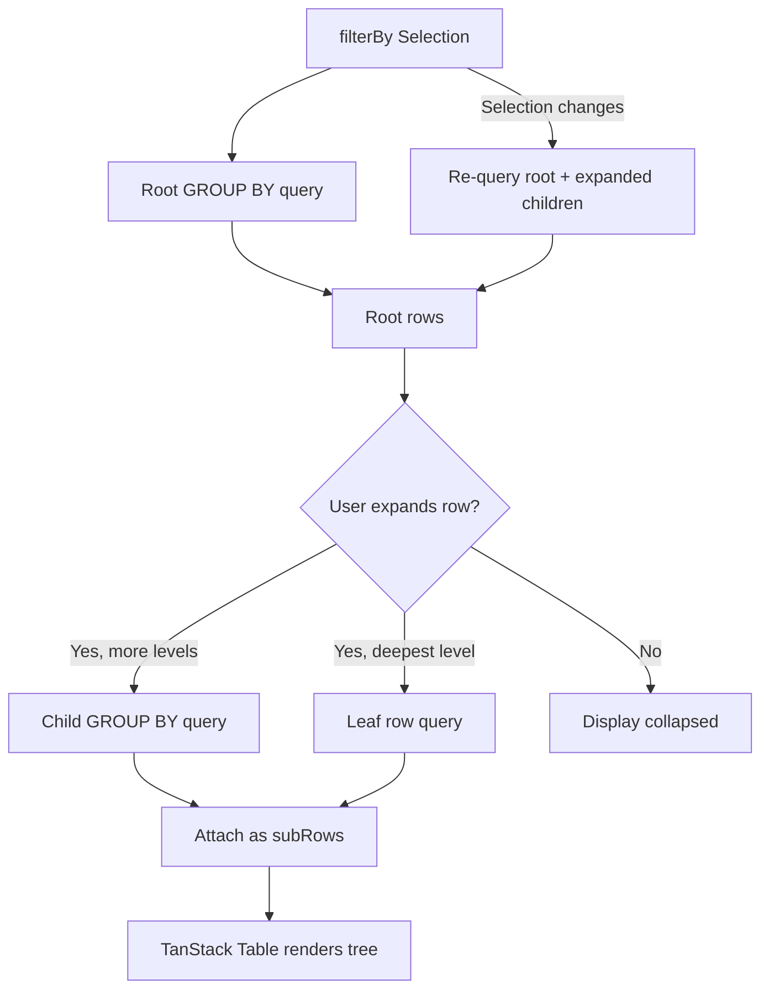

# Grouped Table (Server-Side Hierarchical Grouping)

## When You Need This

- Large datasets where client-side grouping is too slow
- Multi-level drill-down (e.g. Country → Sport → Gender)
- Aggregation metrics at each level with optional leaf row detail

## Quick Start

### 1. Define Hierarchy and Metrics

```ts
import * as mSql from '@uwdata/mosaic-sql';
import type {
  GroupLevel,
  GroupMetric,
} from '@nozzleio/mosaic-tanstack-react-table';

const GROUPED_LEVELS: Array<GroupLevel> = [
  { column: 'nationality', label: 'Country' },
  { column: 'sport', label: 'Sport' },
  { column: 'sex', label: 'Gender' },
];

const GROUPED_METRICS: Array<GroupMetric> = [
  { id: 'count', expression: mSql.count(), label: 'Athletes' },
  { id: 'total_gold', expression: mSql.sum('gold'), label: 'Gold' },
];
```

### 2. Call useServerGroupedTable

```tsx
import { useServerGroupedTable } from '@nozzleio/mosaic-tanstack-react-table';

const { data, expanded, toggleExpand, isRootLoading, totalRootRows } =
  useServerGroupedTable({
    table: 'athletes',
    groupBy: GROUPED_LEVELS,
    metrics: GROUPED_METRICS,
    filterBy: topology.$tableContext,
    enabled: true,
  });
```

### 3. Wire into useReactTable with getExpandedRowModel

```tsx
import {
  useReactTable,
  getCoreRowModel,
  getExpandedRowModel,
} from '@tanstack/react-table';

const table = useReactTable<GroupedRow>({
  data,
  columns: yourColumns,
  state: { expanded },
  onExpandedChange: () => {}, // controlled via toggleExpand
  getSubRows: (row) => row.subRows,
  getRowId: (row) => row._groupId,
  getCoreRowModel: getCoreRowModel(),
  getExpandedRowModel: getExpandedRowModel(),
});
```

## Configuration

### GroupLevel

| Property | Type     | Description                                            |
| -------- | -------- | ------------------------------------------------------ |
| `column` | `string` | SQL column name to GROUP BY at this level              |
| `label`  | `string` | Human-readable label for display. Falls back to column |

### GroupMetric

| Property     | Type        | Description                                                    |
| ------------ | ----------- | -------------------------------------------------------------- |
| `id`         | `string`    | Alias for this metric in the SELECT clause                     |
| `expression` | `ExprValue` | A mosaic-sql expression (e.g. `mSql.count()`, `mSql.sum('x')`) |
| `label`      | `string`    | Human-readable label for the column header                     |

### LeafColumn

| Property | Type     | Description                                                 |
| -------- | -------- | ----------------------------------------------------------- |
| `column` | `string` | SQL column name to fetch                                    |
| `label`  | `string` | Human-readable label for the column header                  |
| `width`  | `number` | Optional width hint in pixels                               |
| `format` | `string` | Optional format hint: `'date'`, `'datetime'`, or `'number'` |

### Full Options (UseServerGroupedTableOptions)

| Property          | Type            | Default | Description                                             |
| ----------------- | --------------- | ------- | ------------------------------------------------------- |
| `table`           | `string`        | —       | Table or view name to query                             |
| `groupBy`         | `GroupLevel[]`  | —       | Hierarchy of columns to group by, in order              |
| `metrics`         | `GroupMetric[]` | —       | Aggregation metrics to compute at each level            |
| `filterBy`        | `Selection`     | —       | Mosaic Selection providing cross-filter predicates      |
| `rowSelection`    | `{ selection }` | —       | Optional row selection integration for cross-filtering  |
| `additionalWhere` | `FilterExpr`    | —       | Additional static WHERE clauses (e.g. NULL exclusion)   |
| `pageSize`        | `number`        | `200`   | Maximum rows per level                                  |
| `leafColumns`     | `LeafColumn[]`  | —       | Columns for raw leaf rows at the deepest level          |
| `leafPageSize`    | `number`        | `50`    | Maximum leaf rows per parent                            |
| `leafSelectAll`   | `boolean`       | `false` | Use SELECT \* for leaf queries instead of named columns |
| `enabled`         | `boolean`       | `true`  | Whether the hook is active                              |

## Return Value

| Property          | Type                             | Description                                         |
| ----------------- | -------------------------------- | --------------------------------------------------- |
| `data`            | `GroupedRow[]`                   | Tree-structured data for TanStack Table             |
| `expanded`        | `ExpandedState`                  | Current expanded state keyed by row ID              |
| `toggleExpand`    | `(row: Row<GroupedRow>) => void` | Toggle expand/collapse. Fires child query if needed |
| `isRootLoading`   | `boolean`                        | Whether the root query is loading                   |
| `totalRootRows`   | `number`                         | Total root-level group count                        |
| `clearSelection`  | `() => void`                     | Clear the current row selection                     |
| `leafColumns`     | `LeafColumn[]`                   | Leaf columns configuration (pass-through)           |
| `tableName`       | `string`                         | Table name (pass-through)                           |
| `additionalWhere` | `FilterExpr`                     | Additional WHERE (pass-through)                     |
| `filterBy`        | `Selection`                      | Filter selection (pass-through)                     |

## How It Works



**Lazy loading:** Only the root level is queried initially. Children are fetched on-demand when a user expands a row. This keeps queries fast even on tables with millions of rows.

**Stale response detection:** A generation counter ensures that when filters change rapidly, only the most recent response is applied. Outdated responses from earlier queries are silently discarded.

**Children cache:** Fetched child rows are cached in a ref. When filters change, all currently-expanded groups are re-queried in parallel to keep the tree consistent.

**Re-query on filter change:** The hook listens to `filterBy` selection events. When filters change, it re-fetches the root level and all expanded children with the new predicate.

## Leaf Rows (Detail Panel)

When `leafColumns` is provided, expanding the deepest grouped level fetches individual data rows instead of another GROUP BY query.

```ts
const LEAF_COLUMNS: Array<LeafColumn> = [
  { column: 'name', label: 'Name' },
  { column: 'height', label: 'Height' },
  { column: 'weight', label: 'Weight' },
];

const result = useServerGroupedTable({
  // ...
  leafColumns: LEAF_COLUMNS,
  leafSelectAll: true, // fetch all columns, not just the named ones
});
```

Leaf rows have `_isLeafRow: true` and carry their data in `leafValues`. Render them differently from group rows:

```tsx
if (row.original._isLeafRow) {
  const values = row.original.leafValues ?? {};
  return <LeafRowComponent values={values} />;
}
```

## Cross-Filtering

### filterBy Integration

The `filterBy` selection provides the cross-filter predicate. When any other component updates the selection (e.g. a histogram brush, a menu input), the grouped table re-queries automatically.

### rowSelection for Output Predicates

To make the grouped table a cross-filter _source_, pass `rowSelection` with a Selection. Use `buildGroupedSelectionPredicate` to generate the predicate when a row is clicked.

## Query Builder API (Advanced)

The core package exports 4 pure functions for building SQL queries:

### buildGroupedLevelQuery

Builds a GROUP BY query for a specific depth level. Returns a `SelectQuery` — call `.toString()` for the SQL string.

### buildLeafRowsQuery

Builds a SELECT query for raw leaf rows (no GROUP BY). Used when expanding the deepest level.

### buildGroupedSelectionPredicate

Builds a compound SQL predicate for a single selected grouped row, including all ancestor constraints.

### buildGroupedMultiSelectionPredicate

Builds a combined predicate for multiple selected rows (OR of compound predicates). Returns `null` for an empty array.

## Complete Example

See `examples/react/trimmed/src/components/views/athletes.tsx` — the `AthletesGroupedTable` component.

The example demonstrates:

1. **3 group levels:** `GROUPED_LEVELS` — Country → Sport → Gender
2. **4 aggregation metrics:** `GROUPED_METRICS` — count, gold, silver, bronze
3. **Leaf columns:** `LEAF_COLUMNS` with `leafSelectAll: true` for full athlete detail
4. **Custom rendering:** `LEAF_COL_STYLES` map for per-column width, class, and format overrides
5. **TanStack Table integration:** `useReactTable` with `getExpandedRowModel()` and controlled `expanded` state
6. **Topology integration:** Uses `topology.$tableContext` as `filterBy` for cross-filtering with the rest of the athletes dashboard

## Next Steps

- [Complex Setup](./complex-setup.md) – Topology patterns and multi-table dashboards
- [Real-World Examples](./real-world-examples.md) – PAA and Athletes dashboards
- [Data Flow](../core/data-flow.md) – Deep dive into query lifecycle
