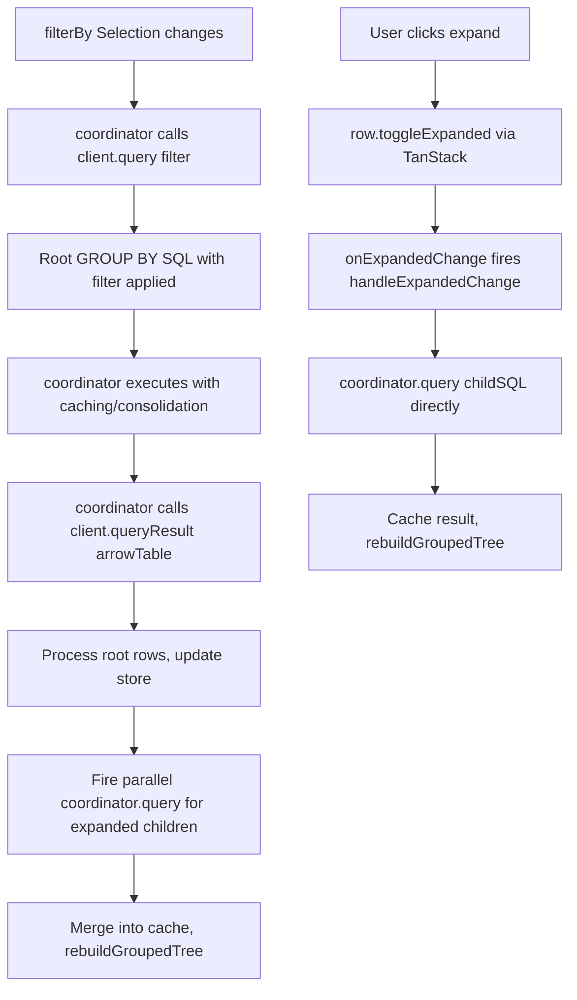

# Grouped Table (Server-Side Hierarchical Grouping)

## When You Need This

- Large datasets where client-side grouping is too slow
- Multi-level drill-down (e.g. Country → Sport → Gender)
- Aggregation metrics at each level with optional leaf row detail

## Quick Start

### 1. Define Hierarchy, Metrics, and Columns

```ts
import * as mSql from '@uwdata/mosaic-sql';
import type {
  FlatGroupedRow,
  GroupLevel,
  GroupMetric,
  LeafColumn,
} from '@nozzleio/mosaic-tanstack-react-table';
import type { ColumnDef } from '@tanstack/react-table';

const LEVELS: Array<GroupLevel> = [
  { column: 'nationality', label: 'Country' },
  { column: 'sport', label: 'Sport' },
  { column: 'sex', label: 'Gender' },
];

const METRICS: Array<GroupMetric> = [
  { id: 'count', expression: mSql.count(), label: 'Athletes' },
  { id: 'total_gold', expression: mSql.sum('gold'), label: 'Gold' },
];

const LEAF_COLUMNS: Array<LeafColumn> = [
  { column: 'name', label: 'Name' },
  { column: 'height', label: 'Height' },
  { column: 'weight', label: 'Weight' },
];

// Column defs use accessorKey — SQL results are top-level properties
const COLUMNS: Array<ColumnDef<FlatGroupedRow, any>> = [
  {
    id: 'group',
    header: 'Group',
    cell: ({ row }) => {
      const meta = row.getGroupMeta();
      if (!meta || meta.type !== 'group') {
        return row.original.name != null ? String(row.original.name) : null;
      }
      const indent = row.depth * 20;
      return (
        <span style={{ paddingLeft: `${indent}px` }}>
          {row.getIsExpanded() ? '▼' : '▶'} {meta.groupValue}
          <span> ({LEVELS[row.depth]?.label})</span>
        </span>
      );
    },
  },
  { accessorKey: 'count', header: 'Athletes' },
  { accessorKey: 'total_gold', header: 'Gold' },
  // Leaf detail columns — blank for group rows, filled for leaf rows
  { accessorKey: 'name', header: 'Name' },
  { accessorKey: 'height', header: 'Height' },
];
```

### 2. Call useMosaicReactTable with groupBy

Grouping is a feature toggle on the existing `useMosaicReactTable` hook — pass a `groupBy` option:

```tsx
import { useMosaicReactTable } from '@nozzleio/mosaic-tanstack-react-table';
import { flexRender, useReactTable } from '@tanstack/react-table';

function GroupedTable({ topology, enabled }) {
  const { tableOptions, client } = useMosaicReactTable<FlatGroupedRow>({
    table: 'athletes',
    filterBy: topology.$combined,
    columns: COLUMNS,
    groupBy: {
      levels: LEVELS,
      metrics: METRICS,
      leafColumns: LEAF_COLUMNS,
      leafSelectAll: true,
    },
    enabled,
  });

  const table = useReactTable(tableOptions);
  const { isRootLoading, totalRootRows } = client.groupedState;

  if (isRootLoading && table.getRowModel().rows.length === 0) {
    return <div>Loading...</div>;
  }

  // Standard TanStack table markup — no special renderer needed
  return (
    <table>
      <thead>
        {table.getHeaderGroups().map((hg) => (
          <tr key={hg.id}>
            {hg.headers.map((h) => (
              <th key={h.id}>
                {!h.isPlaceholder &&
                  flexRender(h.column.columnDef.header, h.getContext())}
              </th>
            ))}
          </tr>
        ))}
      </thead>
      <tbody>
        {table.getRowModel().rows.map((row) => (
          <tr
            key={row.id}
            onClick={() => row.getCanExpand() && row.toggleExpanded()}
          >
            {row.getVisibleCells().map((cell) => (
              <td key={cell.id}>
                {flexRender(cell.column.columnDef.cell, cell.getContext())}
              </td>
            ))}
          </tr>
        ))}
      </tbody>
    </table>
  );
}
```

The `tableOptions` include `onExpandedChange`, `getSubRows`, `getRowId`, `getRowCanExpand`, `getCoreRowModel`, and `getExpandedRowModel` — all pre-configured. TanStack's expanding APIs drive the expand/collapse lifecycle: clicking `row.toggleExpanded()` triggers lazy child queries automatically.

## Architecture

Grouped mode is a feature toggle on `MosaicDataTable`. When `groupBy` is provided, the class branches its `query()`, `queryResult()`, and `getTableOptions()` methods to handle hierarchical GROUP BY queries instead of flat table queries.

The root GROUP BY query goes through the MosaicClient lifecycle — automatic cross-filter updates, query consolidation, caching, and pre-aggregation optimizations via `filterStable`.

Child queries (on user expand) use `coordinator.query()` directly — these are ad-hoc, on-demand queries that don't fit MosaicClient's single-query lifecycle.

Root grouped queries use the same stale-response guard as flat row queries: if
an older root query resolves after a newer request starts, the older response is
ignored. Child queries remain lazy and scoped to expanded group IDs.

## Data Model: FlatGroupedRow

SQL result columns sit at the **top level** of each row, enabling standard TanStack `accessorKey` column definitions. Tree metadata lives under `_groupMeta` (internal), and is exposed via row helper APIs like `row.getGroupMeta()`:

```ts
// Group row from: SELECT nationality, COUNT(*) as count FROM athletes GROUP BY nationality
{
  nationality: "USA",
  count: 500,
  _groupMeta: {
    type: 'group',
    id: "USA",
    depth: 0,
    parentConstraints: {},
    groupColumn: "nationality",
    groupValue: "USA",
  },
  subRows: [...],
}

// Leaf row from: SELECT name, height FROM athletes WHERE nationality='USA' AND sport='Swimming'
{
  name: "Michael Phelps",
  height: 1.93,
  _groupMeta: {
    type: 'leaf',
    id: "USA\x1FSwimming\x1F_leaf_42",
    depth: 2,
    parentConstraints: { nationality: "USA", sport: "Swimming" },
  },
}
```

Group rows have metric values (e.g. `count`, `total_gold`) as top-level properties. Leaf rows have detail values (e.g. `name`, `height`) as top-level properties. Both go through the same `flexRender()` pipeline — cells for missing keys simply render blank.

Grouped row IDs are derived from group metadata and ancestor constraints. The
flat-table `rowId`, field-based row selection, and server-side pinned-row query
path are designed for flat tables; grouped mode continues to use these
group-derived IDs for expansion and row helper APIs.

## Configuration

### groupBy Option

| Property          | Type            | Default | Description                                             |
| ----------------- | --------------- | ------- | ------------------------------------------------------- |
| `levels`          | `GroupLevel[]`  | —       | Hierarchy of columns to group by, in order              |
| `metrics`         | `GroupMetric[]` | —       | Aggregation metrics to compute at each level            |
| `additionalWhere` | `FilterExpr`    | —       | Additional static WHERE clauses (e.g. NULL exclusion)   |
| `pageSize`        | `number`        | `200`   | Maximum rows per level                                  |
| `leafColumns`     | `LeafColumn[]`  | —       | Columns for raw leaf rows at the deepest level          |
| `leafPageSize`    | `number`        | `50`    | Maximum leaf rows per parent                            |
| `leafSelectAll`   | `boolean`       | `false` | Use SELECT \* for leaf queries instead of named columns |

### GroupLevel

| Property | Type     | Description                                            |
| -------- | -------- | ------------------------------------------------------ |
| `column` | `string` | SQL column name to GROUP BY at this level              |
| `label`  | `string` | Human-readable label for display. Falls back to column |

### GroupMetric

| Property     | Type        | Description                                                    |
| ------------ | ----------- | -------------------------------------------------------------- |
| `id`         | `string`    | Alias for this metric in the SELECT clause                     |
| `expression` | `ExprValue` | A mosaic-sql expression (e.g. `mSql.count()`, `mSql.sum('x')`) |
| `label`      | `string`    | Human-readable label for the column header                     |

### LeafColumn

| Property | Type     | Description                                                 |
| -------- | -------- | ----------------------------------------------------------- |
| `column` | `string` | SQL column name to fetch                                    |
| `label`  | `string` | Human-readable label for the column header                  |
| `width`  | `number` | Optional width hint in pixels                               |
| `format` | `string` | Optional format hint: `'date'`, `'datetime'`, or `'number'` |

## Client Accessors

The `client` returned by `useMosaicReactTable` provides grouped-mode accessors:

| Accessor                  | Type      | Description                                                   |
| ------------------------- | --------- | ------------------------------------------------------------- |
| `client.isGroupedMode`    | `boolean` | Whether grouped mode is active                                |
| `client.groupedState`     | `object`  | `{ expanded, loadingGroupIds, totalRootRows, isRootLoading }` |
| `client.isRowLoading(id)` | `boolean` | Whether a specific row is loading children                    |

## Table and Row Helpers (Custom Feature)

Grouped tables register a custom TanStack feature that adds ergonomic helpers to the table and row instances. Prefer these over direct access to `row.original._groupMeta`.

**Table helpers**

| Helper                          | Return Type | Description                                |
| ------------------------------- | ----------- | ------------------------------------------ |
| `table.getIsGroupedMode`        | `boolean`   | Whether grouped mode is active             |
| `table.getGroupedState`         | `object`    | Same shape as `client.groupedState`        |
| `table.isGroupedRowLoading(id)` | `boolean`   | Whether a specific row is loading children |

**Row helpers**

| Helper                            | Return Type                      | Description                                           |
| --------------------------------- | -------------------------------- | ----------------------------------------------------- |
| `row.getGroupMeta()`              | `GroupMeta \| null`              | Returns group metadata or `null` for non-grouped rows |
| `row.getIsGroupedRow()`           | `boolean`                        | True for group rows                                   |
| `row.getIsLeafRow()`              | `boolean`                        | True for leaf rows                                    |
| `row.getGroupId()`                | `string \| null`                 | Composite group ID                                    |
| `row.getGroupDepth()`             | `number \| null`                 | Depth in the group hierarchy                          |
| `row.getGroupValue()`             | `string \| null`                 | Group value (group rows only)                         |
| `row.getGroupParentConstraints()` | `Record<string, string> \| null` | Ancestor constraints                                  |
| `row.getIsLeafParent()`           | `boolean`                        | Whether expanding shows leaf rows                     |

## How It Works


```mermaid
graph TD
    A[filterBy Selection changes] --> B[coordinator calls client.query filter]
    B --> C[Root GROUP BY SQL with filter applied]
    C --> D[coordinator executes with caching/consolidation]
    D --> E[coordinator calls client.queryResult arrowTable]
    E --> F[Process root rows, update store]
    F --> G[Fire parallel coordinator.query for expanded children]
    G --> H[Merge into cache, rebuildGroupedTree]
    I[User clicks expand] --> J[row.toggleExpanded via TanStack]
    J --> K[onExpandedChange fires handleExpandedChange]
    K --> L[coordinator.query childSQL directly]
    L --> M[Cache result, rebuildGroupedTree]
```

**MosaicClient lifecycle:** The root GROUP BY query goes through the coordinator's managed lifecycle (`query()` → `queryResult()`). This gives the grouped table automatic cross-filter updates, query consolidation, caching, and `filterStable` pre-aggregation optimizations.

**Lazy loading:** Only the root level is queried initially. Children are fetched on-demand when a user expands a row via `row.toggleExpanded()`. This keeps queries fast even on tables with millions of rows.

**Children cache:** Fetched child rows are cached. When filters change and `queryResult` processes new root data, expanded children are refreshed via parallel `coordinator.query()` calls.

**TanStack integration:** `onExpandedChange` intercepts TanStack's expand/collapse state changes, triggering lazy child queries for newly expanded rows. The `getSubRows` accessor wires the tree structure. Cell renderers defined in `columns` use `row.getIsExpanded()`, `row.depth`, and `row.getGroupMeta()` for rendering.

## GroupMeta

Each row's `_groupMeta` carries metadata for internal use and cell rendering. Prefer the row helpers (`row.getGroupMeta()`, `row.getIsGroupedRow()`, etc.) in UI code:

| Field               | Type                     | Description                                                |
| ------------------- | ------------------------ | ---------------------------------------------------------- |
| `type`              | `'group' \| 'leaf'`      | Discriminant for row type                                  |
| `id`                | `string`                 | Unique composite ID (segments joined by separator)         |
| `depth`             | `number`                 | Depth in the group hierarchy (0 = root)                    |
| `parentConstraints` | `Record<string, string>` | Ancestor equality constraints for child queries            |
| `groupColumn`       | `string`                 | The SQL column this row was grouped by (group rows only)   |
| `groupValue`        | `string`                 | The value for this group (group rows only)                 |
| `isLeafParent`      | `boolean`                | Whether expanding shows leaf rows instead of deeper groups |

## Cross-Filtering

### filterBy Integration

The `filterBy` selection provides the cross-filter predicate. When any other component updates the selection (e.g. a histogram brush, a menu input), the coordinator automatically re-queries the grouped table via the MosaicClient lifecycle.

### rowSelection for Output Predicates

To make the grouped table a cross-filter _source_, pass `rowSelection` with a Selection. Use `buildGroupedSelectionPredicate` to generate the predicate when a row is clicked.

## Query Builder API (Advanced)

Import these grouped helpers from `@nozzleio/mosaic-tanstack-table-core/grouped`.

### buildGroupedLevelQuery

Builds a GROUP BY query for a specific depth level. Returns a `SelectQuery` — call `.toString()` for the SQL string.

### buildLeafRowsQuery

Builds a SELECT query for raw leaf rows (no GROUP BY). Used when expanding the deepest level.

### buildGroupedSelectionPredicate

Builds a compound SQL predicate for a single selected grouped row, including all ancestor constraints.

### buildGroupedMultiSelectionPredicate

Builds a combined predicate for multiple selected rows (OR of compound predicates). Returns `null` for an empty array.

## Complete Example

See `examples/react/trimmed/src/components/views/athletes.tsx` — the `AthletesGroupedTable` component.

The example demonstrates:

1. **3 group levels:** Country → Sport → Gender
2. **4 aggregation metrics:** count, gold, silver, bronze
3. **Leaf columns:** with `leafSelectAll: true` for full athlete detail
4. **Column definitions with `accessorKey`:** metrics and leaf data render automatically via `flexRender`
5. **Standard TanStack Table markup:** no special renderer component needed
6. **Topology integration:** Uses `topology.$combined` as `filterBy` for cross-filtering with the rest of the athletes dashboard

## Next Steps

- [Complex Setup](./complex-setup.md) – Topology patterns and multi-table dashboards
- [Real-World Examples](./real-world-examples.md) – PAA and Athletes dashboards
- [Data Flow](../core/data-flow.md) – Deep dive into query lifecycle
