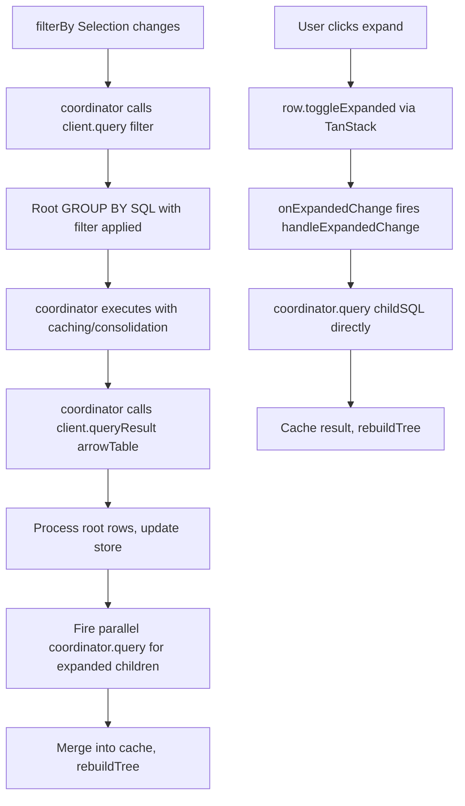

# Grouped Table (Server-Side Hierarchical Grouping)

## When You Need This

- Large datasets where client-side grouping is too slow
- Multi-level drill-down (e.g. Country → Sport → Gender)
- Aggregation metrics at each level with optional leaf row detail

## Quick Start

### 1. Define Hierarchy, Metrics, and Columns

```ts
import * as mSql from '@uwdata/mosaic-sql';
import type {
  GroupLevel,
  GroupMetric,
  ServerGroupedRow,
} from '@nozzleio/mosaic-tanstack-react-table';
import type { ColumnDef, CellContext } from '@tanstack/react-table';

const GROUPED_LEVELS: Array<GroupLevel> = [
  { column: 'nationality', label: 'Country' },
  { column: 'sport', label: 'Sport' },
  { column: 'sex', label: 'Gender' },
];

const GROUPED_METRICS: Array<GroupMetric> = [
  { id: 'count', expression: mSql.count(), label: 'Athletes' },
  { id: 'total_gold', expression: mSql.sum('gold'), label: 'Gold' },
];

const COLUMNS: Array<ColumnDef<ServerGroupedRow, any>> = [
  {
    id: 'group',
    header: 'Group',
    cell: ({ row }: CellContext<ServerGroupedRow, any>) => {
      if (row.original.type !== 'group') return null;
      const indent = row.depth * 20;
      return (
        <span style={{ paddingLeft: `${indent}px` }}>
          {row.getIsExpanded() ? '▼' : '▶'} {row.original.groupValue}
        </span>
      );
    },
  },
  {
    id: 'count',
    header: 'Athletes',
    cell: ({ row }: CellContext<ServerGroupedRow, any>) => {
      if (row.original.type !== 'group') return null;
      return row.original.metrics.count?.toLocaleString() ?? '—';
    },
    meta: { align: 'right' },
  },
];
```

### 2. Call useServerGroupedTable

The hook returns `tableOptions` — pass them directly to `useReactTable()`:

```tsx
import { useServerGroupedTable } from '@nozzleio/mosaic-tanstack-react-table';
import { useReactTable } from '@tanstack/react-table';

const { tableOptions, isRootLoading, totalRootRows, loadingGroupIds } =
  useServerGroupedTable({
    table: 'athletes',
    groupBy: GROUPED_LEVELS,
    metrics: GROUPED_METRICS,
    filterBy: topology.$tableContext,
    columns: COLUMNS,
    enabled: true,
  });

const table = useReactTable(tableOptions);
```

The `tableOptions` include `onExpandedChange`, `getSubRows`, `getRowId`, `getCoreRowModel`, and `getExpandedRowModel` — all pre-configured. TanStack's expanding APIs drive the expand/collapse lifecycle: clicking `row.toggleExpanded()` triggers lazy child queries automatically.

## Architecture

`MosaicGroupedTable` extends `MosaicClient`, giving the root GROUP BY query the full Mosaic lifecycle — automatic cross-filter updates, query consolidation, caching, and pre-aggregation optimizations.

Child queries (on user expand) use `coordinator.query()` directly — these are ad-hoc, on-demand queries that don't fit MosaicClient's single-query lifecycle.

## Configuration

### GroupLevel

| Property | Type     | Description                                            |
| -------- | -------- | ------------------------------------------------------ |
| `column` | `string` | SQL column name to GROUP BY at this level              |
| `label`  | `string` | Human-readable label for display. Falls back to column |

### GroupMetric

| Property     | Type        | Description                                                    |
| ------------ | ----------- | -------------------------------------------------------------- |
| `id`         | `string`    | Alias for this metric in the SELECT clause                     |
| `expression` | `ExprValue` | A mosaic-sql expression (e.g. `mSql.count()`, `mSql.sum('x')`) |
| `label`      | `string`    | Human-readable label for the column header                     |

### LeafColumn

| Property | Type     | Description                                                 |
| -------- | -------- | ----------------------------------------------------------- |
| `column` | `string` | SQL column name to fetch                                    |
| `label`  | `string` | Human-readable label for the column header                  |
| `width`  | `number` | Optional width hint in pixels                               |
| `format` | `string` | Optional format hint: `'date'`, `'datetime'`, or `'number'` |

### Full Options (UseServerGroupedTableOptions)

| Property          | Type                            | Default | Description                                             |
| ----------------- | ------------------------------- | ------- | ------------------------------------------------------- |
| `table`           | `string`                        | —       | Table or view name to query                             |
| `groupBy`         | `GroupLevel[]`                  | —       | Hierarchy of columns to group by, in order              |
| `metrics`         | `GroupMetric[]`                 | —       | Aggregation metrics to compute at each level            |
| `filterBy`        | `Selection`                     | —       | Mosaic Selection providing cross-filter predicates      |
| `columns`         | `ColumnDef<ServerGroupedRow>[]` | —       | TanStack column definitions with cell renderers         |
| `rowSelection`    | `{ selection }`                 | —       | Optional row selection integration for cross-filtering  |
| `additionalWhere` | `FilterExpr`                    | —       | Additional static WHERE clauses (e.g. NULL exclusion)   |
| `pageSize`        | `number`                        | `200`   | Maximum rows per level                                  |
| `leafColumns`     | `LeafColumn[]`                  | —       | Columns for raw leaf rows at the deepest level          |
| `leafPageSize`    | `number`                        | `50`    | Maximum leaf rows per parent                            |
| `leafSelectAll`   | `boolean`                       | `false` | Use SELECT \* for leaf queries instead of named columns |
| `enabled`         | `boolean`                       | `true`  | Whether the hook is active                              |

## Return Value

| Property          | Type                             | Description                              |
| ----------------- | -------------------------------- | ---------------------------------------- |
| `tableOptions`    | `TableOptions<ServerGroupedRow>` | Pass directly to `useReactTable()`       |
| `client`          | `MosaicGroupedTable`             | Core client for programmatic access      |
| `loadingGroupIds` | `string[]`                       | IDs of groups currently loading children |
| `isRootLoading`   | `boolean`                        | Whether the root query is loading        |
| `totalRootRows`   | `number`                         | Total root-level group count             |

## How It Works


```mermaid
graph TD
    A[filterBy Selection changes] --> B[coordinator calls client.query filter]
    B --> C[Root GROUP BY SQL with filter applied]
    C --> D[coordinator executes with caching/consolidation]
    D --> E[coordinator calls client.queryResult arrowTable]
    E --> F[Process root rows, update store]
    F --> G[Fire parallel coordinator.query for expanded children]
    G --> H[Merge into cache, rebuildTree]
    I[User clicks expand] --> J[row.toggleExpanded via TanStack]
    J --> K[onExpandedChange fires handleExpandedChange]
    K --> L[coordinator.query childSQL directly]
    L --> M[Cache result, rebuildTree]
```

**MosaicClient lifecycle:** The root GROUP BY query goes through the coordinator's managed lifecycle (`query()` → `queryResult()`). This gives the grouped table automatic cross-filter updates, query consolidation, caching, and `filterStable` pre-aggregation optimizations.

**Lazy loading:** Only the root level is queried initially. Children are fetched on-demand when a user expands a row via `row.toggleExpanded()`. This keeps queries fast even on tables with millions of rows.

**Children cache:** Fetched child rows are cached. When filters change and `queryResult` processes new root data, expanded children are refreshed via parallel `coordinator.query()` calls.

**TanStack integration:** `onExpandedChange` intercepts TanStack's expand/collapse state changes, triggering lazy child queries for newly expanded rows. The `getSubRows` accessor wires the tree structure. Cell renderers defined in `columns` use `row.getIsExpanded()`, `row.depth`, and `row.original` for rendering.

## Leaf Rows (Detail Panel)

When `leafColumns` is provided, expanding the deepest grouped level fetches individual data rows instead of another GROUP BY query.

```ts
const LEAF_COLUMNS: Array<LeafColumn> = [
  { column: 'name', label: 'Name' },
  { column: 'height', label: 'Height' },
  { column: 'weight', label: 'Weight' },
];

const result = useServerGroupedTable({
  // ...
  leafColumns: LEAF_COLUMNS,
  leafSelectAll: true, // fetch all columns, not just the named ones
});
```

Leaf rows have `type: 'leaf'` and carry their data in `values`. Render them differently from group rows:

```tsx
if (row.original.type === 'leaf') {
  const values = row.original.values;
  return <LeafRowComponent values={values} />;
}
```

## Cross-Filtering

### filterBy Integration

The `filterBy` selection provides the cross-filter predicate. When any other component updates the selection (e.g. a histogram brush, a menu input), the coordinator automatically re-queries the grouped table via the MosaicClient lifecycle.

### rowSelection for Output Predicates

To make the grouped table a cross-filter _source_, pass `rowSelection` with a Selection. Use `buildGroupedSelectionPredicate` to generate the predicate when a row is clicked.

## GroupRow Metadata

Each `GroupRow` carries embedded metadata for internal use:

| Field                | Type                     | Description                                                |
| -------------------- | ------------------------ | ---------------------------------------------------------- |
| `_depth`             | `number`                 | Depth in the group hierarchy (0 = root)                    |
| `_parentConstraints` | `Record<string, string>` | Ancestor equality constraints for child queries            |
| `_groupColumn`       | `string`                 | The SQL column this row was grouped by                     |
| `_isDetailPanel`     | `boolean`                | Whether expanding shows leaf rows instead of deeper groups |

## Query Builder API (Advanced)

The core package exports 4 pure functions for building SQL queries:

### buildGroupedLevelQuery

Builds a GROUP BY query for a specific depth level. Returns a `SelectQuery` — call `.toString()` for the SQL string.

### buildLeafRowsQuery

Builds a SELECT query for raw leaf rows (no GROUP BY). Used when expanding the deepest level.

### buildGroupedSelectionPredicate

Builds a compound SQL predicate for a single selected grouped row, including all ancestor constraints.

### buildGroupedMultiSelectionPredicate

Builds a combined predicate for multiple selected rows (OR of compound predicates). Returns `null` for an empty array.

## Complete Example

See `examples/react/trimmed/src/components/views/athletes.tsx` — the `AthletesGroupedTable` component.

The example demonstrates:

1. **3 group levels:** `GROUPED_LEVELS` — Country → Sport → Gender
2. **4 aggregation metrics:** `GROUPED_METRICS` — count, gold, silver, bronze
3. **Leaf columns:** `LEAF_COLUMNS` with `leafSelectAll: true` for full athlete detail
4. **Column definitions with cell renderers:** `GROUPED_TABLE_COLUMNS` using `flexRender`, `row.getIsExpanded()`, `row.depth`
5. **TanStack Table integration:** `useReactTable(tableOptions)` — single call, fully configured
6. **Topology integration:** Uses `topology.$combined` as `filterBy` for cross-filtering with the rest of the athletes dashboard

## Next Steps

- [Complex Setup](./complex-setup.md) – Topology patterns and multi-table dashboards
- [Real-World Examples](./real-world-examples.md) – PAA and Athletes dashboards
- [Data Flow](../core/data-flow.md) – Deep dive into query lifecycle
